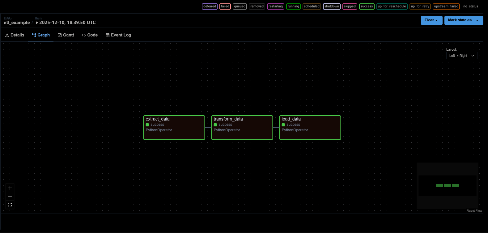
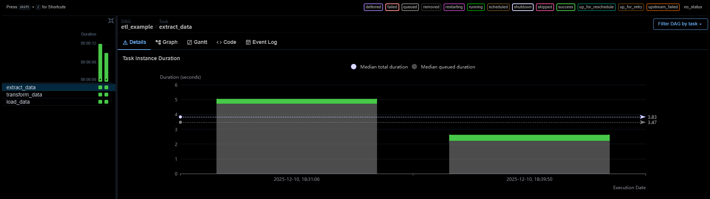

# 🚀 Airflow Docker Project  
A fully containerized Apache Airflow environment running with Docker Compose on WSL2 (Ubuntu).  
Includes a complete ETL pipeline, persistent storage, and a production-like Airflow architecture.

## 📌 Overview

This project demonstrates how to build and run a professional Apache Airflow environment using Docker.  
It includes:

- Webserver, Scheduler, Worker & Triggerer  
- Redis + Postgres backend  
- Persistent volumes (DAGs, Logs, Data, Plugins, Config)  
- A complete ETL pipeline (extract → transform → load)  
- A clean, reproducible setup for portfolio or real-world deployment

This repository is ideal for:
- Learning Airflow internals  
- Demonstrating ETL / Orchestration skills  
- Building a foundation for bigger Data Engineering projects  

## 🧱 Architecture

              +------------------------+
              |      Webserver         |
              |  (UI & DAG rendering)  |
              +-----------+------------+
                          |
                          v
+-------------+    +------+-------+    +-------------+
|  Triggerer  | -> |  Scheduler   | -> |   Worker     |
+-------------+    +------+-------+    +-------------+
                          |
                          v
                   +--------------+
                   |   Postgres   |
                   |  Metadata DB |
                   +--------------+
                          |
                          v
                   +--------------+
                   |    Redis     |
                   |   Message    |
                   |     Queue    |
                   +--------------+

Volumes:
- dags/ → /opt/airflow/dags
- logs/ → /opt/airflow/logs
- data/ → /opt/airflow/data
- plugins/ → /opt/airflow/plugins
- config/ → /opt/airflow/config

airflow-docker-project/
│
├── dags/
│   ├── hello_dag.py
│   └── etl_example.py
│
├── data/                  # CSV files generated by ETL
├── logs/                  # Airflow logs (not in Git)
├── plugins/               # Optional custom plugins
├── config/                # Airflow configuration overrides
│
├── docker-compose.yaml
├── .env                   # Local environment settings (NOT in Git)
└── README.md

🛠️ Technology Stack

Apache Airflow 2.10.x
Docker & Docker Compose
Postgres 13 (Airflow metadata DB)
Redis (Celery message broker)
Celery Executor
WSL2 Ubuntu
Python 3.12 (inside containers)

⚙️ Setup & Installation
1 Clone the repository
git clone https://github.com/<yourusername>/airflow-docker-project.git
cd airflow-docker-project

2 Create local .env file
AIRFLOW_UID=1000
AIRFLOW_PROJ_DIR=/home/ben/airflow-docker

3 Initialize Airflow
docker compose up airflow-init

4 Start all services
docker compose up -d

5 Access the Airflow UI
http://localhost:8080
User: airflow
Password: airflow

🔄 Run the ETL Pipeline

The project includes a complete ETL DAG:

Extract → Transform → Load

Key location inside containers:
DATA_DIR = "/opt/airflow/data"

Trigger it manually via UI:

Go to DAGs
Select etl_example
Click ▶ Trigger DAG

Output CSVs will appear in:

data/raw.csv
data/processed.csv

